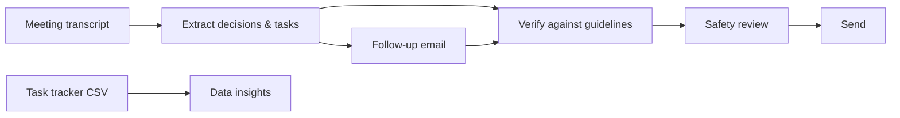

# 🤖 Meeting Follow-up Assistant

> Final project for **L0-FGP · Generative AI for Productivity**, delivered through [SDAIA Academy](https://github.com/SDAIAAcademy).

<!-- ✏️ Replace every line marked ✏️ with your own content, then delete these comments. -->

## 📌 Project description
✏️ In 3–4 sentences: what does this project do, and for whom?

## 🎯 The problem
✏️ What goes wrong after meetings without a clear follow-up? Why does it matter?

## 🔄 How it works

✏️ Adjust the diagram if your workflow is different.

## 🛠️ Tools used
| Step | Tool | Why I chose it |
|---|---|---|
| Extraction & email | ✏️ | ✏️ |
| Data insights | ✏️ | ✏️ |
| Verification | Gemini Notebook (formerly NotebookLM) | ✏️ |
| Personal assistant | ✏️ Gem / other | ✏️ |

## 🚀 How to use this assistant
✏️ Step-by-step instructions so a colleague could reuse your assistant next week:
1. ✏️
2. ✏️
3. ✏️

## 📁 Repository structure
| Folder | Contents |
|---|---|
| `prompts/` | Prompts for each step, with before → after versions |
| `outputs/` | Final follow-up email and data summary |
| `verification/` | Source checks and safety review |
| `assistant/` | Assistant instructions and test results |
| `docs/` | Technical documentation |
| `data/` | Fictional training data used in this project |

## 🔎 Verification & safety summary
✏️ 2–3 lines: what did you catch and correct? What still needs human review?

## 💡 How I'll use this at work
✏️ One short paragraph (see `docs/how-i-will-use-it.md`).

## 🎓 Training program
This project was completed as part of **L0-FGP · Generative AI for Productivity (الذكاء الاصطناعي التوليدي لرفع الإنتاجية)**, delivered through **SDAIA Academy** → https://github.com/SDAIAAcademy

## 👤 Author
✏️ Your name · ✏️ LinkedIn (optional)

> ⚠️ All data in this repository is fictional and was provided for training purposes.
